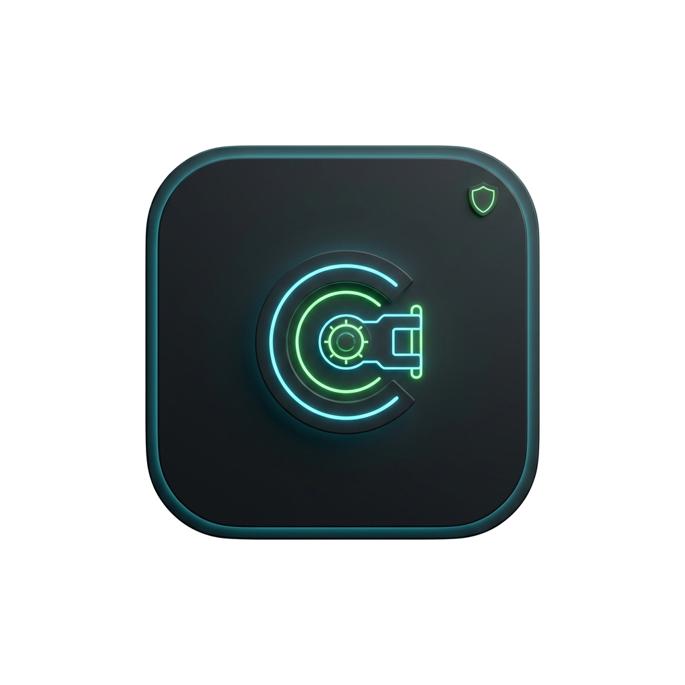
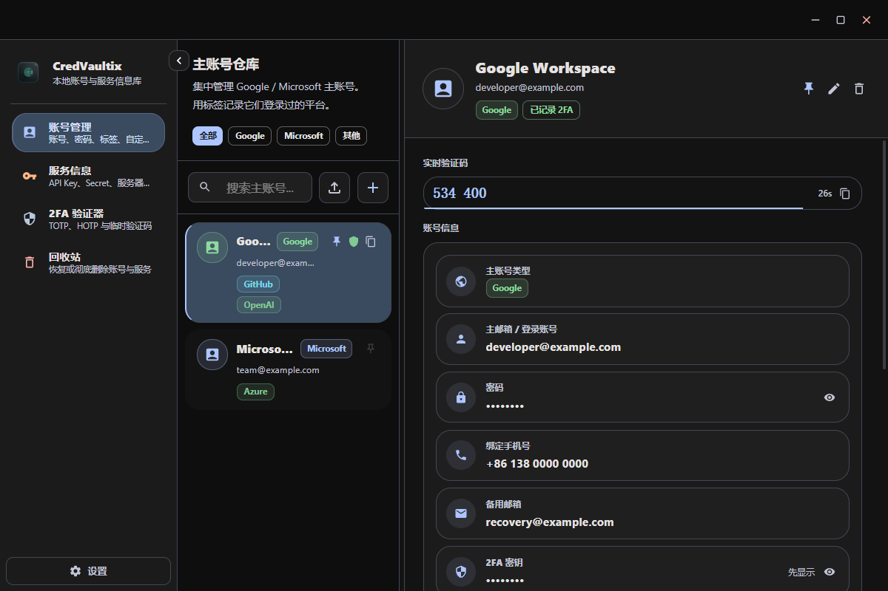
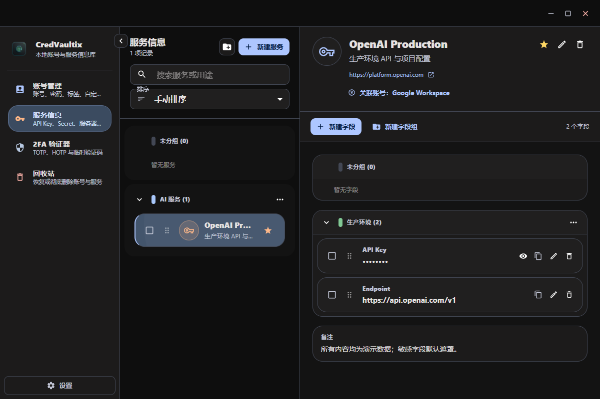
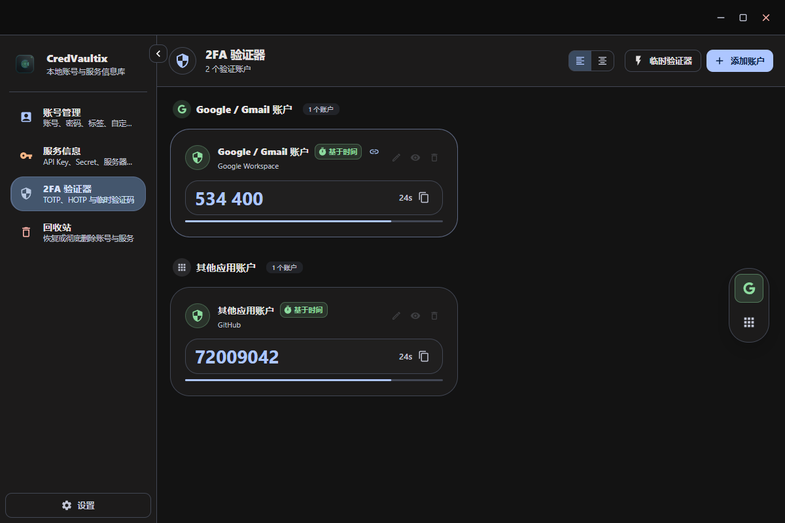
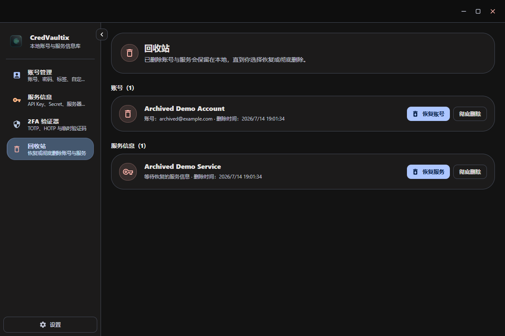

<p align="center">
  
</p>

<h1 align="center">CredVaultix</h1>

<p align="center">
  <strong>离线优先的 Windows 账号、2FA 与 API 密钥资料库</strong>
</p>

<p align="center">
  
  
  
  
  
</p>

CredVaultix 用于集中整理 Google / Microsoft 主账号、密码、恢复资料、TOTP/HOTP 验证码，以及 API Key、服务器、MCP、云厂商等自由结构的服务信息。应用不依赖自建服务器，不加载第三方字体或统计脚本，不包含遥测，数据保存在当前 Windows 用户目录。

## 界面预览

以下截图使用纯演示数据生成，不包含真实账号或密钥。

| 主账号与恢复资料 | 服务信息与 API Key |
|---|---|
|  |  |

| TOTP / HOTP 验证器 | 账号与服务统一回收站 |
|---|---|
|  |  |

## 功能

### 主账号管理

- 保存账号名称、登录邮箱、密码、手机号、备用邮箱、2FA 密钥和备注。
- 使用全局复用标签记录 GitHub、Discord、Notion、OpenAI 等注册平台，并可在完整标签目录中右键删除不再需要的标签。
- 自定义字段支持普通值与敏感值、编辑、复制和默认遮罩。
- 支持平台筛选、解密后搜索、置顶、自定义排序和 CSV 导入（兼容常见账号列与 OTP URI）。
- 删除账号先进入回收站，可恢复或彻底删除。

### 服务信息与 API 密钥

- 自由创建 API Key、服务器、MCP、云厂商或项目环境记录，不绑定厂商模板。
- 每项服务可以保存用途、URL、备注、关联主账号和任意自定义字段。
- 敏感字段加密保存并默认隐藏；普通字段直接展示。
- 支持收藏、搜索、外部分组、内部字段组、多选移动和持久化拖拽排序。
- 删除服务进入统一回收站，不再产生无法恢复的隐藏记录。

### 2FA 验证器

- 支持 TOTP 与 HOTP，能够粘贴标准 `otpauth://` URI。
- 保留 SHA1 / SHA256 / SHA512、6/8 位验证码、刷新周期和 HOTP 计数器。
- 支持编辑、复制、临时内存验证器，以及从验证码跳转到关联主账号。
- 账号彻底删除后，关联验证码保留为孤立提醒，避免误删登录能力。

### 数据与更新

- JSON 与 SQLite 备份导入/导出；SQLite 导出使用一致性备份 API。
- 导入前验证 JSON 结构或 SQLite 完整性，并自动备份当前数据库。
- 设置页支持检查、下载并安装 GitHub Release 更新；安装前会生成并验证数据库安全备份。
- 更新安装向导保持可见，启动失败时保留已校验安装包，并可从设置页打开更新日志后重试。
- 主题、侧栏、列表宽度、排序、置顶和 2FA 对齐偏好统一持久化。

## 安全说明

敏感账号字段、敏感服务字段和 2FA 密钥会使用 AES-256-GCM 加密后写入 SQLite；Electron 开启渲染沙箱与上下文隔离、关闭渲染进程 Node.js 集成，并阻止应用页面跳转到外部内容。

当前版本尚未提供主密码。现有本地加密主要避免数据库中的直接明文暴露，不能抵御已经取得当前 Windows 用户权限的攻击者。跨设备密码备份、自动锁定和剪贴板自动清理仍需要产品范围确认。

请在保存真实生产凭据前阅读 [安全模型](docs/SECURITY.md)。

## 安装

从 [GitHub Releases](https://github.com/zzf-857/CredVaultix/releases) 下载最新的 `CredVaultix-Setup-X.Y.Z.exe`。

当前安装包尚未配置 Windows 代码签名证书，首次运行可能出现 SmartScreen 提示。请只从本项目 Releases 页面下载安装包并核对发布来源。

从 `v1.1.0` 或更早版本更新时，旧更新器可能只关闭应用而未启动安装程序。遇到这种情况，请从 Releases 手动运行一次最新安装包；账号数据库位于独立的用户数据目录，不会随程序目录覆盖。

## 本地开发

环境要求：

- Node.js 22.12 或更高版本
- Windows 10/11 x64
- Git

```powershell
git clone https://github.com/zzf-857/CredVaultix.git
cd CredVaultix
npm ci
npm run electron:dev
```

常用命令：

```powershell
npm test                 # 运行行为与组件测试
npm run typecheck        # 检查渲染进程和 Electron 类型
npm run verify           # 测试 + 类型检查 + 生产前端构建
npm run electron:build   # 构建 Windows NSIS 安装包
```

## 数据位置与备份

默认数据目录：

```text
%APPDATA%\CredVaultix\
├── credvaultix.db
├── credvaultix.db-wal
├── credvaultix.db-shm
├── preferences.json
└── credvaultix-before-*.db
```

不要只复制正在运行时的单个 `credvaultix.db`。优先使用设置中的“导出数据库”，它会创建一致性 SQLite 备份或结构化 JSON 备份。

## 项目结构

```text
CredVaultix/
├── .github/workflows/       # main CI 与标签发布流程
├── electron/                # 主进程、SQLite、加密、备份和 IPC
├── scripts/                 # 版本校验与 Release Notes 工具
├── shared/                  # 主进程与渲染进程共用的 OTP URI 解析
├── src/
│   ├── components/          # 账号、2FA、回收站、设置
│   │   └── service-info/    # 服务与 API 密钥管理
│   ├── stores/              # Zustand 应用状态
│   ├── theme/               # Material UI 深浅主题
│   └── utils/               # OTP、排序、搜索和安全密码工具
├── CHANGELOG.md
└── package.json
```

## 发布维护

- [提交、发布与自动更新手册](docs/release_and_updater_manual.md)
- [更新日志](CHANGELOG.md)
- [安全模型](docs/SECURITY.md)

正式发布必须使用与 `package.json` 一致的 annotated tag。标签推送后，GitHub Actions 会重新运行校验并上传安装包、blockmap 与 `latest.yml`。

## 规划中的候选能力

- 主密码、自动锁定和 Windows Hello / DPAPI 辅助解锁
- 带独立密码的可移植加密备份
- 剪贴板定时清理
- 密码强度、重复密码和过期 API Key 检查
- 2FA 二维码识别与安全检查中心

浏览器自动填充和云同步暂不进入当前实现范围。

## License

[MIT](LICENSE)
